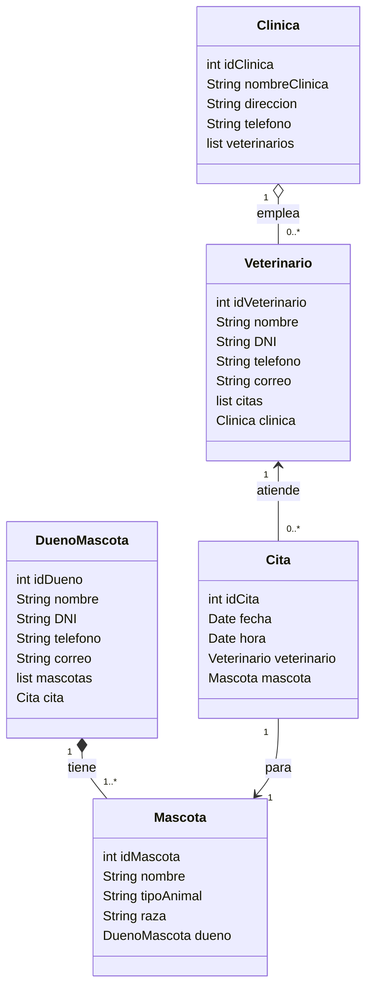

# Clínica Veterinaria

Proyecto de ejemplo de una aplicación de gestión de clínica veterinaria desarrollada en Java.

## ✅ Descripción

Esta aplicación modela el dominio básico de una clínica veterinaria: dueños, mascotas, veterinarios y citas. Proporciona una estructura de clases y un DAO simple para manejar la persistencia (actualmente en memoria / basada en el modelo del proyecto).

## 🧱 Estructura del proyecto

- `pom.xml` - Configuración del proyecto Maven.
- `src/main/java` - Código fuente principal.
  - `org.palomafp.clinicaveterinaria` - Paquete principal con las clases del modelo.
- `src/test/java` - Pruebas unitarias.
- `doc/` - Documentación relacionada (diagramas, explicaciones, etc.).

## 🚀 Requisitos

- Java 11+ (compatible con Maven)
- Maven 3.6+

## 🧩 Clases principales

- `Clinica` - Clase principal del dominio.
- `Cita` - Representa una cita en la clínica.
- `DuenyoMascota` - Representa al dueño de una mascota.
- `Mascota` - Representa una mascota.
- `Veterinario` - Representa un veterinario.
- `CitaDAO` - Ejemplo de acceso a datos para gestionar citas.

## 📝 Diagrama de clases

