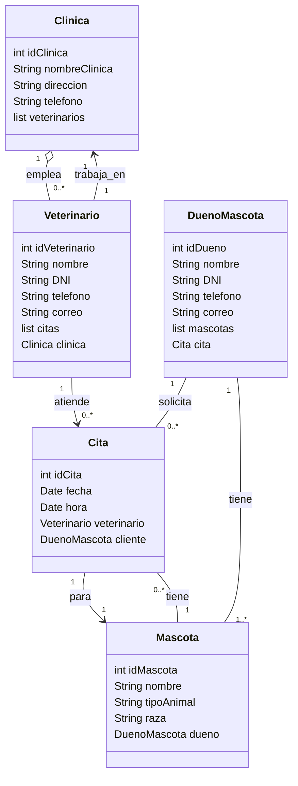

```mermaid

classDiagram

Clinica "1" o-- "0..*" Veterinario : emplea
Veterinario "1" --> "1" Clinica : trabaja_en
Veterinario "1" --> "0..*" Cita : atiende
DuenoMascota "1" -- "0..*" Cita : solicita
DuenoMascota "1" -- "1..*" Mascota : tiene
Cita "1" --> "1" Mascota : para
Mascota "1" -- "0..*" Cita : tiene

class Clinica {
    int idClinica
    String nombreClinica
    String direccion
    String telefono
    list<Veterinario> veterinarios
}

class Veterinario {
    int idVeterinario
    String nombre
    String DNI
    String telefono
    String correo
    list<Cita> citas
    Clinica clinica
}

class Cita {
    int idCita
    Date fecha
    Date hora
    Veterinario veterinario
    DuenoMascota cliente
}

class DuenoMascota {
    int idDueno
    String nombre
    String DNI
    String telefono
    String correo
    list<Mascota> mascotas
    Cita cita
}

class Mascota {
    int idMascota
    String nombre
    String tipoAnimal
    String raza
    DuenoMascota dueno
}

```